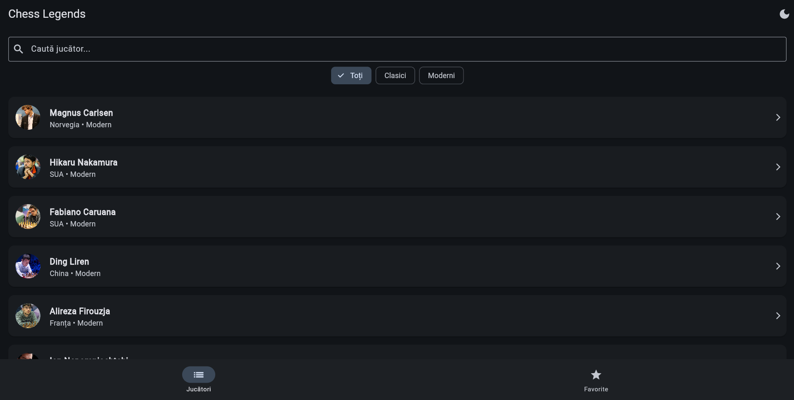
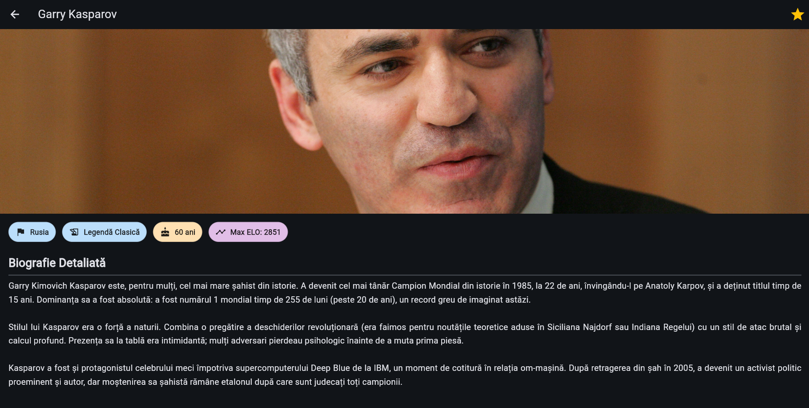
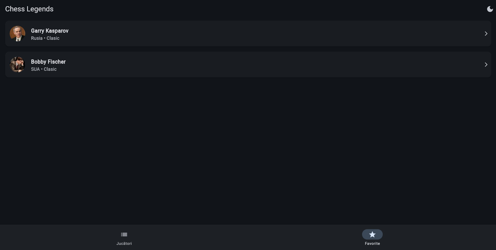

# ♟️ Chess Legends: The Grandmaster Encyclopedia

> **From the Romantic Era to the AI Generation – A journey through the minds that mastered the 64 squares.**

## 📖 About the Project

**Chess Legends** is not just a list; it is an interactive compendium designed for chess enthusiasts and history buffs. The application bridges the gap between the artistic genius of the **Classic Era** (Morphy, Capablanca, Fischer) and the precise calculation of the **Modern Era** (Carlsen, Nakamura, Ding Liren).

Whether you are looking to study the "Magician from Riga" or understand the dominance of Magnus Carlsen, this app puts the history of chess in your pocket.

## ✨ Key Features

* **👥 Dual Era System:** Filter legends by **Classic** (Historical Giants) or **Modern** (Current Elite) eras.
* **🔎 Smart Search:** Instantly find your favorite Grandmaster by name.
* **📚 Deep Biographies:** Curated, educational content with over 300 words per player, detailing their style, greatest achievements, and historical impact.
* **⭐ Personal Favorites:** Build your own "Dream Team" by saving players to your Favorites list.
* **📊 At-a-Glance Stats:** View Country, Age, Peak ELO, and Era instantly.
* **🎨 Dynamic Theming:** Optimized UI that looks great in both Light and Dark modes.

## 📱 App Screenshots

| Home Screen | Player Details | Favorites |
|:-----------:|:--------------:|:---------:|
|  |  |  |

*(Note: The images above demonstrate the Clean UI and Era-based color coding)*

## 🛠️ Tech Stack

* **Framework:** Flutter & Dart
* **Architecture:** Clean Code Principles (Modular & Scalable)
* **Navigation:** Material Page Route
* **State Management:** `setState` (Optimized for performance)
* **Assets:** Local asset management & Network Image rendering

## 🚀 Getting Started

1.  **Clone the repository:**
    ```bash
    git clone [https://github.com/yourusername/chess_legends.git](https://github.com/yourusername/chess_legends.git)
    ```
2.  **Navigate to the project folder:**
    ```bash
    cd chess_legends
    ```
3.  **Get dependencies:**
    ```bash
    flutter pub get
    ```
4.  **Run the app:**
    ```bash
    flutter run
    ```

## 👨‍💻 Author

Developed with ❤️ by **Frincu Timotei** as part of the Mobile Development Course.

---
*“Chess is life in miniature.” – Garry Kasparov*